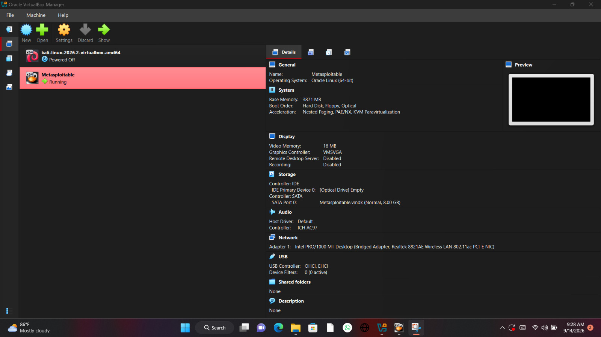

# Step 3: Creating and Configuring the VM

## Create a new virtual machine
1. Open VirtualBox Manager
2. Click **New**
3. Set:
   - **Name:** Kali Linux
   - **Type:** Linux
   - **Version:** Debian (64-bit)
4. Click **Next**

## Allocate resources
- **Memory (RAM):** At least 2048 MB, 4096 MB recommended if your host has enough
- **Processors:** 2 CPUs recommended

## Create a virtual hard disk
1. Choose **Create a virtual hard disk now**
2. File type: **VDI (VirtualBox Disk Image)**
3. Storage: **Dynamically allocated**
4. Size: **25 GB minimum**

## Attach the Kali ISO
1. Select your new VM in the list, click **Settings**
2. Go to **Storage**
3. Under **Controller: IDE**, click the empty optical drive
4. Click the disk icon → **Choose a disk file**
5. Select the Kali Linux `.iso` you downloaded in Step 2

## Verify your VM is ready
Your VM should now appear in the VirtualBox Manager list, powered off and ready to boot into the Kali installer.

## Next step
→ [Installing Kali Linux](04-kali-installation.md)
